# No-Trade Windows

The platform can block trading during specific time windows defined in the `no_trade` configuration.
This document explains the available fields, dataset masking options, and runtime enforcement.

## Configuration fields

| Field | Type | Description |
|------|------|-------------|
| `funding_buffer_min` | int | Minutes before and after funding events (00:00, 08:00, 16:00 UTC) where trading is blocked. |
| `daily_utc` | list[str] | Daily repeating windows in `HH:MM-HH:MM` (UTC). Windows should not cross midnight. |
| `custom_ms` | list[dict] | One-off windows with explicit start and end timestamps in milliseconds since epoch. |
| `dynamic_guard` | dict | Optional dynamic guard that can pause trading based on volatility/spread metrics. |

### `dynamic_guard` fields

| Field | Type | Default | Description |
|-------|------|---------|-------------|
| `enable` | bool | `false` | Enable the dynamic guard when `true`. |
| `sigma_window` | int or null | `null` | Rolling window (bars) for computing price sigma; guard ignores this trigger when `null`. |
| `atr_window` | int or null | `null` | Rolling window (bars) for ATR-based spread checks; ignored when `null`. |
| `vol_abs` | float or null | `null` | Absolute volatility threshold. Leave `null` to disable. |
| `vol_pctile` | float or null | `null` | Percentile threshold (0-1) for volatility. |
| `spread_abs_bps` | float or null | `null` | Absolute spread threshold in basis points. |
| `spread_pctile` | float or null | `null` | Percentile threshold (0-1) for spread. |
| `hysteresis` | float or null | `null` | Relative buffer before the guard re-enables trading. |
| `cooldown_bars` | int | `0` | Bars to wait after the guard condition clears. |
| `log_reason` | bool | `false` | Emit a log entry when the guard blocks trades. |

Example YAML:

```yaml
no_trade:
  funding_buffer_min: 5
  daily_utc:
    - "00:00-00:05"
    - "08:00-08:05"
    - "16:00-16:05"
  custom_ms:
    - {start_ts_ms: 1696118400000, end_ts_ms: 1696122000000}
  dynamic_guard:
    enable: false
    sigma_window: 120
    atr_window: 14
    vol_abs: null
    vol_pctile: 0.99
    spread_abs_bps: null
    spread_pctile: 0.99
    hysteresis: 0.1
    cooldown_bars: 10
    log_reason: true
```

## Applying the mask to datasets

`no_trade` windows can be applied to datasets either by **dropping** offending rows, **weighting** them with `train_weight=0`, or exporting a **mask** with the `--mask-only` flag.
Use the `no-trade-mask` CLI (installed with this project) or pass `--no-trade-mode` to training scripts.

```bash
# remove rows
no-trade-mask --data raw.csv --sandbox_config configs/legacy_sandbox.yaml --mode drop

# keep rows but set train_weight=0
no-trade-mask --data raw.csv --sandbox_config configs/legacy_sandbox.yaml --mode weight

# output mask only
no-trade-mask --data raw.csv --sandbox_config configs/legacy_sandbox.yaml --mask-only
```

Effect on a sample dataset:

| ts_ms | price | train_weight |
|-------|-------|--------------|
| 1000  | 1.0   | 1.0 |
| 2000  | 1.2   | 0.0 *(inside no-trade window)* |
| 3000  | 1.1   | 1.0 |

## Runtime enforcement

`TradingEnv` precomputes a mask from the configuration and skips agent actions when the current step falls inside a blocked window.
The environment also tracks the ratio of blocked steps via `info["no_trade_stats"]`.

```python
from no_trade import compute_no_trade_mask
from no_trade_config import get_no_trade_config
import pandas as pd

cfg = get_no_trade_config("configs/legacy_sandbox.yaml")
df = pd.DataFrame({"ts_ms": [0]})
mask = compute_no_trade_mask(df, sandbox_yaml_path="configs/legacy_sandbox.yaml")

def skip_action():
    pass

if mask.iloc[0]:
    skip_action()  # no orders are sent; step is counted as blocked
```

## Typical schedule

A common setup blocks short windows around maintenance and funding events.

```mermaid
gantt
dateFormat  HH:mm
axisFormat %H:%M
title No-trade windows example (UTC)
section Maintenance
Daily restart :00:00, 00:05
section Funding buffer
Around funding 1 :07:55, 08:05
Around funding 2 :15:55, 16:05
```



Additional one-off windows can be specified with `custom_ms`:

```yaml
no_trade:
  custom_ms:
    - {start_ts_ms: 1700000000000, end_ts_ms: 1700001800000}  # 2023-11-14 00:00-00:30 UTC
```

